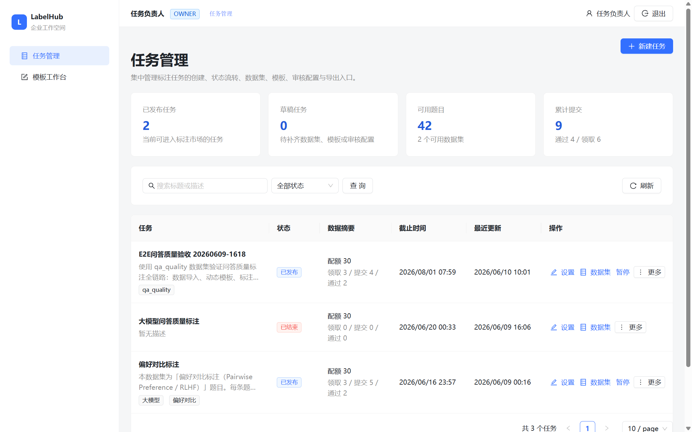
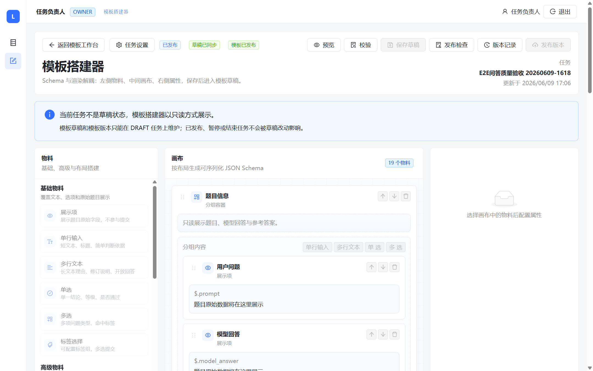
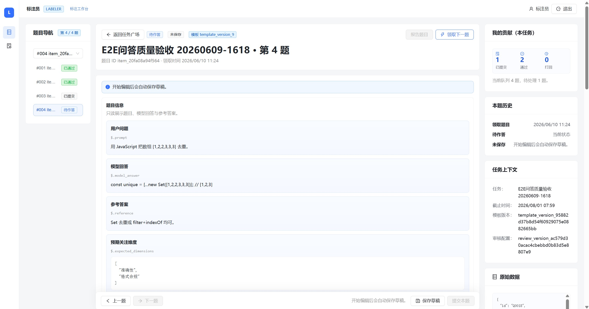
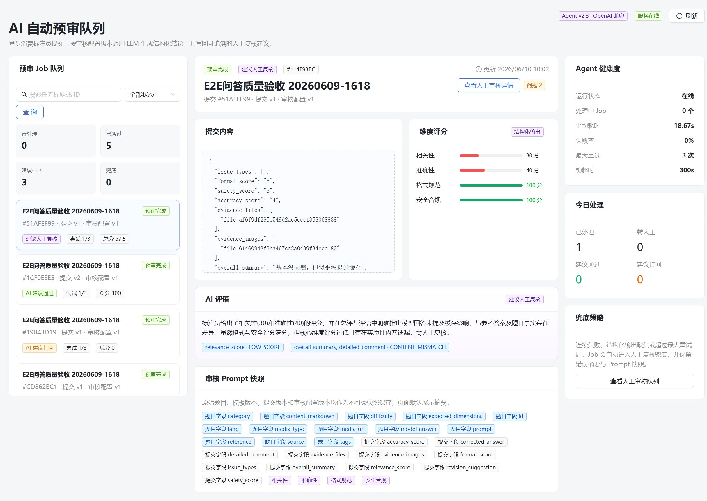
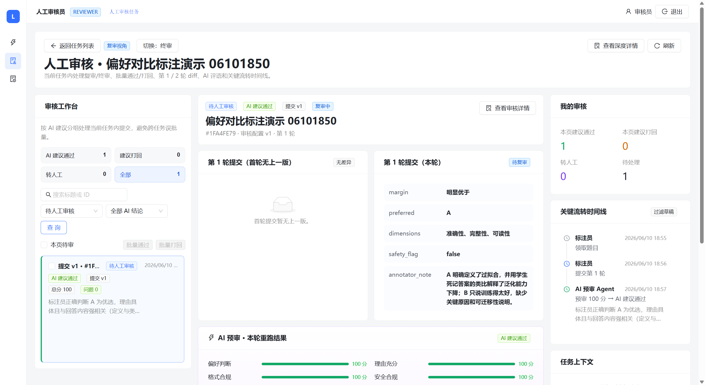
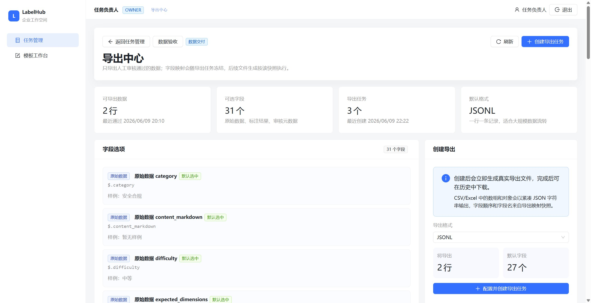

<p align="center">
  
</p>

<h1 align="center">LabelHub 数据标注平台</h1>

<p align="center">
  <strong>AI Data Operation Platform</strong><br/>
  面向任务生产、动态标注、AI 预审、人工复核和多格式交付的一体化数据标注平台
</p>

<p align="center">
  
  
  
  
  
</p>

LabelHub 是一个面向数据标注生产链路的前后端分离平台，覆盖任务创建、数据导入、动态模板搭建、标注员作答、题目级 LLM 辅助、AI 自动预审、人工复核、数据验收和多格式导出。系统采用 Monorepo 组织，前端、后端和 Agent 独立运行又共享同一套接口契约。

## 核心能力

| 角色 | 能力 |
| --- | --- |
| 任务负责人 Owner | 创建任务、导入数据集、搭建标注模板、配置审核规则、发布任务、验收数据、导出结果 |
| 标注员 Labeler | 浏览任务广场、领取题目、基于动态模板作答、自动保存草稿、提交标注、查看返修意见 |
| AI Agent | 按 OpenAI API 兼容格式调用 LLM，对提交结果进行异步预审并写回结构化评分与建议 |
| 人工审核员 Reviewer | 查看 AI 预审队列、按任务复核、查看多轮 diff、执行打回、直接修订或通过入库 |

## 项目架构


## 技术栈

| 层 | 技术 |
| --- | --- |
| 前端 |   <br/>自研 TemplateSchemaVO + React Renderer、Zustand、@dnd-kit/core |
| 后端 |   <br/>Pydantic v2、Alembic、PyMySQL、uv |
| Agent |   <br/>OpenAI Chat Completions 兼容协议 |
| 数据库 |  |
| 工程 |    |

## 仓库结构

```text
LabelHub/
  apps/
    web/      React 前端应用
    api/      FastAPI 后端服务
    agent/    AI 预审 Agent
  demo_data/  演示数据集
  docs/       需求、架构、数据库、API、测试和部署文档
  infra/      Docker Compose、Nginx、部署脚本
  packages/   共享包预留目录
  submission/ 交付文档整理目录
```

## Demo 演示

[在线演示视频](https://app.guidde.com/share/playbooks/2zCGB8UiQ3JBLDwpzf3LMw?origin=f1cCjKyKKtR68i7nyi9VTtPViI73&mode=videoOnly)

| 任务生产与管理 | 动态模板搭建 |
| --- | --- |
|  |  |

| 标注工作台 | AI 预审队列 |
| --- | --- |
|  |  |

| 人工审核工作台 | 导出中心 |
| --- | --- |
|  |  |

更多页面截图见 `submission/Demo截图/Demo截图说明.md`。

## 本地运行

### 1. 准备环境

- Node.js 20+
- pnpm 9+
- Python 3.11+
- uv
- Docker Desktop

### 2. 配置环境变量

在仓库根目录复制示例配置：

```powershell
Copy-Item .env.example .env
```

LLM 相关变量只写入本地 `.env` 或服务器环境文件，不提交到 Git：

```env
OPENAI_API_KEY=your-api-key
BASE_URL=https://your-openai-compatible-provider/v1
MODEL_NAME=your-model-name
```

### 3. 启动 MySQL

在仓库根目录执行：

```powershell
docker compose -f infra/docker/compose.yaml up -d mysql
```

### 4. 启动后端 API

```powershell
cd apps/api
uv sync
uv run alembic upgrade head
uv run python -m labelhub_api
```

后端默认地址：`http://localhost:8000`  
OpenAPI 文档：`http://localhost:8000/api/docs`

### 5. 启动 Agent

```powershell
cd apps/agent
uv sync
uv run python -m labelhub_agent --loop
```

Agent 会轮询待预审任务，调用 OpenAI 兼容 LLM 后写回预审结果。

### 6. 启动前端

在仓库根目录执行：

```powershell
pnpm install
pnpm --filter @labelhub/web dev
```

前端默认地址：`http://localhost:5173`

## Demo 账号

| 角色 | 邮箱 | 密码 |
| --- | --- | --- |
| Owner | `owner@labelhub.dev` | `labelhub123` |
| Labeler | `labeler@labelhub.dev` | `labelhub123` |
| Reviewer | `reviewer@labelhub.dev` | `labelhub123` |

## 常用命令

| 场景 | 命令 | 说明 |
| --- | --- | --- |
| 前端开发 | `pnpm --filter @labelhub/web dev` | 本地开发时启动 Vite |
| 前端构建 | `pnpm --filter @labelhub/web build` | 生产构建和部署前检查 |
| 前端测试 | `pnpm --filter @labelhub/web test` | 运行前端单元与集成测试 |
| 后端迁移 | `cd apps/api && uv run alembic upgrade head` | 初始化或升级 MySQL 表结构 |
| 后端测试 | `cd apps/api && uv run pytest` | 运行 API 单元与集成测试 |
| Agent 测试 | `cd apps/agent && uv run pytest` | 运行 Agent 单元与集成测试 |
| 本地 Compose | `docker compose -f infra/docker/compose.yaml up -d` | 启动本地依赖服务 |

## 关键设计

- **任务绑定模板版本**：模板草稿属于具体任务，发布后生成不可变模板版本，保证历史提交、审核和导出字段可复现。
- **后端掌握状态机**：任务、题目领取、提交、AI 预审、人工审核和导出状态均由后端校验和迁移，前端只发起意图。
- **动态模板统一协议**：Owner Designer、Owner 预览、Labeler 作答和导出字段都消费同一份 `TemplateSchemaVO`。
- **OpenAI 兼容 LLM 接入**：题目级 LLM 辅助和 AI 预审均通过标准 Chat Completions 兼容格式调用，便于替换供应商。
- **证据附件闭环**：文件和图片上传落入统一文件对象，支持 PDF、Word、Excel、JSON、纯文本、Markdown 与常见图片格式；标注提交保存受控引用，审核页以文件名、类型、大小和图片缩略图展示附件，不暴露内部文件 ID。
- **可追溯审计**：关键节点写入审计日志，人工审核时间线过滤高频草稿保存，仅展示领取、提交、AI 预审和人工决策等核心流转。
- **导出快照**：导出任务保存字段映射快照和文件元数据，后续模板或字段名变化不会影响历史导出复现。

## 测试覆盖

| 类型 | 覆盖 | 结果 |
| --- | --- | --- |
| 单元测试 | 前端工具、后端服务、Agent 配置与解析 | 81 个用例通过 |
| 集成测试 | 任务、数据、模板、标注、AI 预审、人工审核、文件附件、导出 | 79 个用例通过 |
| 真实浏览器验收 | Owner -> Labeler -> Agent -> Reviewer -> Export 全链路 | 通过 |

详细报告见：

- `docs/单元测试报告.md`
- `docs/集成测试报告.md`
- `docs/真实浏览器全流程验收测试报告.md`

## 部署

生产部署使用 Docker Compose 一键拉起 Web、API、Agent 和 MySQL。部署说明见：

- `docs/生产部署说明.md`
- `docs/演示环境说明.md`

当前演示环境访问地址：

```text
http://121.196.209.131:18080/
```

## 开源协议

本项目使用 MIT License，详见 `LICENSE`。

## 文档

| 文档 | 路径 |
| --- | --- |
| 需求分析 | `docs/需求分析文档.md` |
| Demo 范围 | `docs/Demo范围文档.md` |
| 系统架构 | `docs/系统架构文档.md` |
| 数据库设计 | `docs/数据库设计文档.md` |
| API 文档 | `docs/API文档.md` |
| 技术选型 | `docs/技术选型基线.md` |
| 开发计划 | `docs/开发粒度与实施计划.md` |
| 部署说明 | `docs/生产部署说明.md` |

