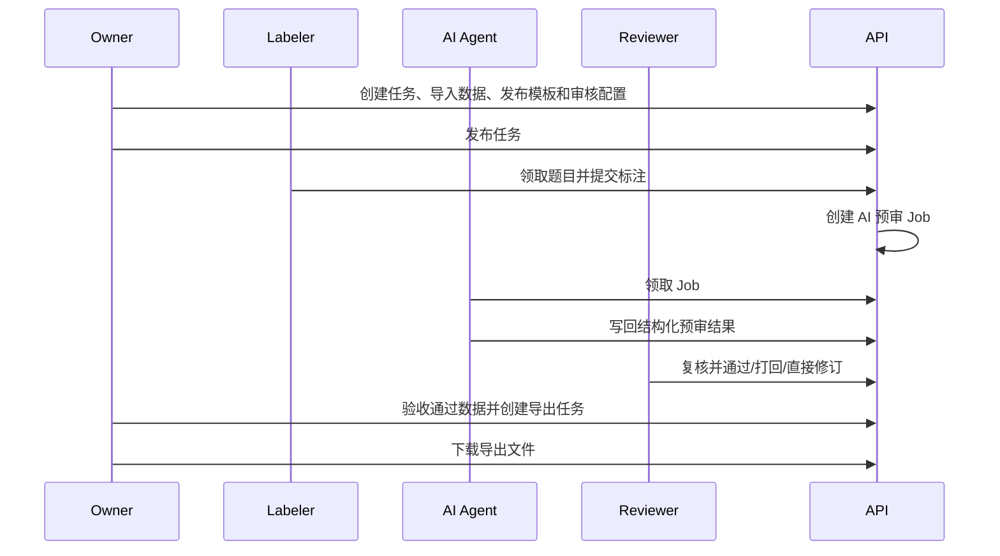

# LabelHub API 文档

## 1. 文档说明

本文档记录 LabelHub 当前后端 API 契约。接口基于 FastAPI 实现，默认前缀为 `/api`，本地 OpenAPI 页面为 `http://localhost:8000/api/docs`。

## 2. 基础约定

| 项目 | 说明 |
| --- | --- |
| 本地 API | `http://localhost:8000/api` |
| 演示环境 API | `http://121.196.209.131:18080/api` |
| 数据格式 | 请求与响应默认使用 JSON |
| 登录态 | `POST /api/auth/login` 成功后写入 HttpOnly Cookie |
| 分页 | 列表接口使用 `page`、`pageSize`，响应为 `PageVO` |
| 时间 | API 返回 ISO 时间，前端按浏览器时区展示 |
| 系统接口 | Agent 内部接口使用服务端系统令牌，不在前端调用 |

统一错误结构：

```json
{
  "code": "VALIDATION_ERROR",
  "message": "可读错误信息",
  "details": {}
}
```

## 3. 枚举

| 类型 | 可选值 |
| --- | --- |
| 用户角色 | `OWNER`、`LABELER`、`REVIEWER`、`SYSTEM` |
| 任务状态 | `DRAFT`、`PUBLISHED`、`PAUSED`、`ENDED` |
| 数据集格式 | `JSON`、`JSONL`、`EXCEL`、`MIXED` |
| 数据集状态 | `IMPORTING`、`READY`、`FAILED` |
| 题目状态 | `AVAILABLE`、`CLAIMED`、`DISABLED` |
| 标注状态 | `CLAIMED`、`DRAFT_SAVED`、`SUBMITTED`、`RETURNED`、`APPROVED`、`CANCELLED` |
| AI 预审 Job 状态 | `QUEUED`、`RUNNING`、`SUCCEEDED`、`FAILED`、`NEEDS_HUMAN_REVIEW` |
| AI 结论 | `PASS`、`RETURN`、`NEEDS_HUMAN_REVIEW` |
| 人工审核状态 | `PENDING_HUMAN_REVIEW`、`APPROVED`、`RETURNED` |
| 人工决策 | `APPROVE`、`RETURN`、`DIRECT_REVISE` |
| 模板物料 | `SHOW_ITEM`、`TEXT_INPUT`、`TEXTAREA`、`RADIO`、`CHECKBOX`、`TAG_SELECT`、`RICH_TEXT`、`FILE_UPLOAD`、`IMAGE_UPLOAD`、`JSON_EDITOR`、`LLM_ACTION`、`GROUP`、`TABS` |
| 导出格式 | `JSON`、`JSONL`、`CSV`、`EXCEL` |
| 导出状态 | `QUEUED`、`RUNNING`、`SUCCEEDED`、`FAILED` |

## 4. 鉴权与健康检查

| 方法 | 路径 | 权限 | 说明 |
| --- | --- | --- | --- |
| `GET` | `/api/health` | 无 | 服务健康检查 |
| `POST` | `/api/auth/login` | 无 | 使用邮箱和密码登录，写入 Cookie |
| `GET` | `/api/auth/me` | 已登录 | 获取当前用户 |
| `POST` | `/api/auth/logout` | 已登录 | 清除登录态 |

登录请求示例：

```json
{
  "email": "owner@labelhub.dev",
  "password": "labelhub123"
}
```

## 5. 文件对象

| 方法 | 路径 | 权限 | 说明 |
| --- | --- | --- | --- |
| `POST` | `/api/files` | 已登录 | 创建文件元数据，用于导入、证据和导出文件登记 |
| `GET` | `/api/files/{fileId}` | 已登录 | 获取文件元数据、下载地址和图片预览地址 |
| `GET` | `/api/files/{fileId}/download` | 已登录 | 下载文件；图片可通过 `?inline=true` 以内联预览方式返回 |

文件对象只记录元信息、相对对象 key 与可访问 URL，真实文件落盘路径由后端配置决定。`FileObjectVO` 返回 `downloadUrl`、`previewUrl` 和 `isImage`，供标注工作台、审核工作台和导出中心统一渲染。文件上传默认支持 PDF、Word、Excel、JSON、纯文本与 Markdown 文档，图片上传默认支持 PNG、JPEG 与 WebP；证据上传单文件服务端硬上限为 `100 MB`，模板物料可通过 `maxSizeMb` 配置更小的业务上限。

## 6. Owner 任务管理

| 方法 | 路径 | 权限 | 说明 |
| --- | --- | --- | --- |
| `GET` | `/api/tasks` | Owner | 分页查询任务，支持 `status`、`keyword` |
| `GET` | `/api/tasks/summary` | Owner | Owner 首页任务统计 |
| `POST` | `/api/tasks` | Owner | 创建草稿任务 |
| `GET` | `/api/tasks/{taskId}` | Owner | 获取任务详情 |
| `PATCH` | `/api/tasks/{taskId}` | Owner | 更新任务基础信息 |
| `POST` | `/api/tasks/{taskId}/state-transitions` | Owner | 发布、暂停、恢复、结束任务 |
| `GET` | `/api/tasks/{taskId}/publish-check` | Owner | 发布前完整性检查 |
| `GET` | `/api/tasks/{taskId}/acceptance-stats` | Owner | 数据验收统计 |

任务创建核心字段：

```json
{
  "title": "问答质量评估",
  "description": "评估模型回答质量",
  "instructionRichText": "请按评分维度完成标注",
  "tags": ["问答", "质量"],
  "rewardRule": "0.3 元/题",
  "quota": 30,
  "deadlineAt": "2026-12-31T23:59:59+08:00",
  "distributionStrategy": "FIRST_COME_FIRST_SERVED"
}
```

发布前检查会校验任务状态、配额、截止时间、数据集、模板版本和审核配置版本；存在阻塞项时不会进入已发布状态。

## 7. 数据集导入与题目管理

| 方法 | 路径 | 权限 | 说明 |
| --- | --- | --- | --- |
| `POST` | `/api/tasks/{taskId}/import-jobs` | Owner | 创建数据导入任务 |
| `GET` | `/api/import-jobs/{importJobId}` | Owner | 查询导入结果 |
| `GET` | `/api/import-jobs/{importJobId}/errors` | Owner | 分页查询错误行 |
| `GET` | `/api/tasks/{taskId}/datasets` | Owner | 查询任务数据集 |
| `GET` | `/api/datasets/{datasetId}/items` | Owner | 预览题目，支持分页和关键词 |
| `PATCH` | `/api/datasets/{datasetId}/items:batch` | Owner | 批量启用、禁用或编辑题目 |

导入请求会读取已登记文件，支持 JSON、JSONL 和 Excel。导入完成后，`dataset_items.payload` 保存原始题目 JSON，用于模板预览、标注渲染和导出。

## 8. 模板 Designer / Renderer

| 方法 | 路径 | 权限 | 说明 |
| --- | --- | --- | --- |
| `GET` | `/api/tasks/{taskId}/template-draft` | Owner | 获取任务模板草稿 |
| `PUT` | `/api/tasks/{taskId}/template-draft` | Owner | 保存模板草稿 |
| `POST` | `/api/template-schemas:validate` | Owner | 校验模板 Schema |
| `POST` | `/api/tasks/{taskId}/template-versions` | Owner | 发布不可变模板版本 |
| `GET` | `/api/tasks/{taskId}/template-versions` | Owner | 查询模板版本列表 |
| `GET` | `/api/template-versions/{templateVersionId}` | Owner / Labeler / Reviewer | 获取模板版本快照 |

模板版本发布后会写入 `tasks.current_template_version_id`。历史提交始终引用领取时的模板版本，不受后续草稿修改影响。

模板 Schema 摘要：

```json
{
  "version": "1.0",
  "components": [
    {
      "id": "component_prompt",
      "type": "SHOW_ITEM",
      "label": "题目原文",
      "props": { "path": "$.prompt" }
    }
  ],
  "layout": { "root": ["component_prompt"] }
}
```

## 9. 审核配置

| 方法 | 路径 | 权限 | 说明 |
| --- | --- | --- | --- |
| `GET` | `/api/tasks/{taskId}/review-config-draft` | Owner | 获取审核配置草稿 |
| `PUT` | `/api/tasks/{taskId}/review-config-draft` | Owner | 保存审核配置草稿 |
| `POST` | `/api/tasks/{taskId}/review-config-versions` | Owner | 发布审核配置版本 |
| `GET` | `/api/tasks/{taskId}/review-config-versions` | Owner | 查询审核配置版本列表 |

审核配置包括 Prompt、评分维度、通过阈值、打回阈值和结构化输出 Schema。发布后的版本用于 AI 预审，不会被草稿修改影响。

## 10. Labeler 任务广场与作答

| 方法 | 路径 | 权限 | 说明 |
| --- | --- | --- | --- |
| `GET` | `/api/marketplace/tasks` | Labeler | 查询可领取任务 |
| `POST` | `/api/tasks/{taskId}/assignments` | Labeler | 领取题目 |
| `GET` | `/api/assignments` | Labeler | 查询我的领取列表 |
| `GET` | `/api/assignments/{assignmentId}` | Labeler | 获取作答上下文 |
| `PUT` | `/api/assignments/{assignmentId}/draft` | Labeler | 保存草稿 |
| `POST` | `/api/assignments/{assignmentId}/submissions` | Labeler | 提交正式标注 |
| `POST` | `/api/assignments/{assignmentId}/llm-actions/{componentId}:run` | Labeler | 运行题目级 LLM 辅助 |
| `GET` | `/api/me/contribution-stats` | Labeler | 我的贡献统计 |
| `GET` | `/api/me/contributions` | Labeler | 我的贡献列表 |

提交接口会按领取时固化的模板版本校验字段、必填项、隐藏字段裁剪和文件引用。文件/图片字段提交值使用结构化文件引用数组，包含 `id`、`fileName`、`mimeType`、`sizeBytes`、`downloadUrl`、`previewUrl` 和 `isImage`；历史字符串引用仅用于兼容读取。题目级 LLM 辅助只生成参考建议，不会自动提交。

## 11. AI 自动预审与 Agent

| 方法 | 路径 | 权限 | 说明 |
| --- | --- | --- | --- |
| `GET` | `/api/review-jobs/summary` | Reviewer | AI 预审队列统计 |
| `GET` | `/api/review-jobs` | Reviewer | AI 预审队列列表 |
| `POST` | `/api/internal/review-jobs:claim` | System | Agent 领取待处理 Job |
| `POST` | `/api/internal/review-jobs/{jobId}/results` | System | Agent 写回预审结果 |

Agent 领取 Job 后获得不可变题目快照、提交版本、模板版本和审核配置版本，调用 OpenAI 兼容 LLM 并写回结构化结果。重复提交、超时重试和失败兜底均由后端状态机保护。

## 12. Reviewer 人工审核

| 方法 | 路径 | 权限 | 说明 |
| --- | --- | --- | --- |
| `GET` | `/api/reviews/tasks` | Reviewer | 按任务聚合的人工审核任务列表 |
| `GET` | `/api/reviews` | Reviewer | 人工审核记录列表 |
| `GET` | `/api/reviews/{reviewId}` | Reviewer | 审核详情，包含 diff、AI 评语、时间线 |
| `POST` | `/api/reviews/{reviewId}/decisions` | Reviewer | 单条人工决策 |
| `POST` | `/api/reviews:batch-decide` | Reviewer | 批量通过或批量打回 |

人工决策请求：

```json
{
  "decision": "APPROVE",
  "comment": "审核通过，可进入导出范围",
  "revisedValues": null
}
```

`RETURN` 会回写标注返修状态；`DIRECT_REVISE` 会保存审核员修订后的值并入库；`APPROVE` 会将记录加入可验收、可导出范围。

## 13. 导出中心

| 方法 | 路径 | 权限 | 说明 |
| --- | --- | --- | --- |
| `GET` | `/api/tasks/{taskId}/export-field-options` | Owner | 查询可导出字段 |
| `GET` | `/api/tasks/{taskId}/export-jobs` | Owner | 查询导出历史 |
| `POST` | `/api/tasks/{taskId}/export-jobs` | Owner | 创建导出任务 |
| `GET` | `/api/export-jobs/{exportJobId}` | Owner | 查询导出任务详情 |
| `POST` | `/api/export-jobs/{exportJobId}/retry` | Owner | 重试失败或异常等待任务 |
| `GET` | `/api/export-jobs/{exportJobId}/download` | Owner | 下载导出文件 |

导出任务请求：

```json
{
  "format": "JSONL",
  "includeReviewRecord": true,
  "includeAuditTimeline": false,
  "fieldMappings": [
    {
      "source": "DATASET_PAYLOAD",
      "path": "$.prompt",
      "outputName": "item_prompt"
    }
  ],
  "idempotencyKey": "export-task-001"
}
```

导出只包含人工审核通过的数据，支持 JSON、JSONL、CSV 和 Excel。数组和对象在 CSV/Excel 中序列化为 JSON 字符串。

## 14. 审计日志

| 方法 | 路径 | 权限 | 说明 |
| --- | --- | --- | --- |
| `GET` | `/api/audit-logs` | 已登录 | 按实体类型和实体 ID 查询审计日志 |

审计实体覆盖任务、数据集、题目、导入、审核配置、模板、领取、提交、AI 预审、人工审核、LLM 辅助、文件和导出。前端时间线会按场景过滤高频过程日志，只展示关键流转节点。

## 15. 端到端主链路


