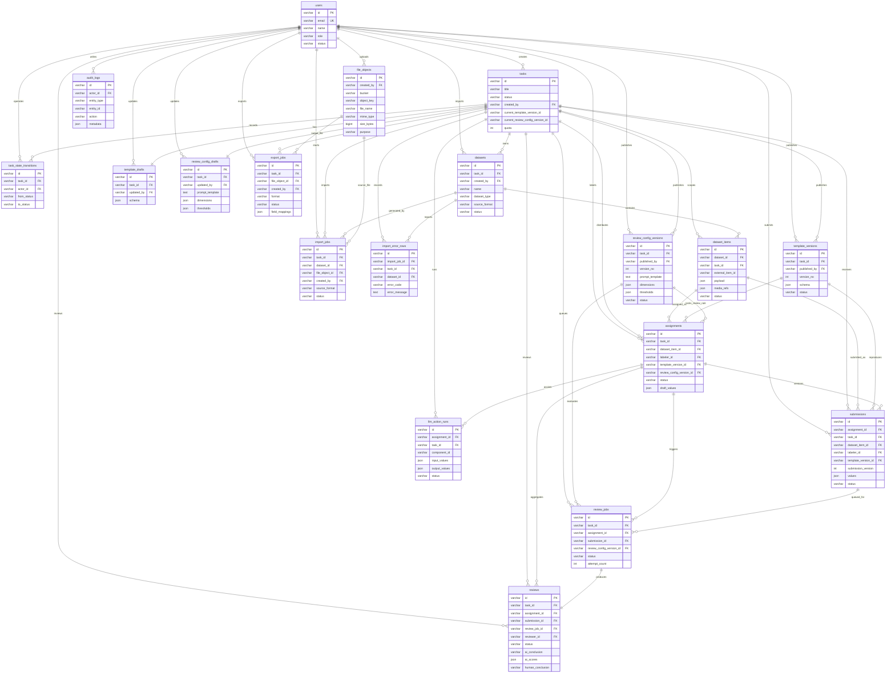

# LabelHub 数据库设计文档

## 1. 设计目标

数据库设计需要支持以下能力：

- 多角色用户与权限。
- 任务创建、发布、暂停、结束。
- 多格式数据导入和题目 payload 存储。
- 动态模板草稿与不可变版本。
- 标注领取、草稿、提交版本。
- AI 预审与人工审核记录。
- 打回返修和 diff 追溯。
- 审计日志。
- 多格式异步导出。

建议使用 MySQL 作为主数据库，Python 后端通过 SQLAlchemy 管理数据访问，并使用 Alembic 管理迁移。动态题目内容、模板 schema、提交值和 AI 输出可使用 JSON 字段存储，但状态、关系、索引字段应结构化。

## 2. 命名约定

- 表名使用复数 snake_case。
- 主键统一使用 `id`。
- 外键使用 `{entity}_id`。
- 时间字段使用 `created_at`、`updated_at`。
- 状态字段使用字符串枚举。
- JSON 字段只存业务可变结构，不存可索引核心状态。

## 3. 核心实体关系

```text
users
  ├─ tasks.created_by
  ├─ assignments.labeler_id
  ├─ submissions.labeler_id
  ├─ reviews.reviewer_id
  └─ audit_logs.actor_id

tasks
  ├─ datasets
  ├─ template_drafts
  ├─ template_versions
  ├─ review_config_drafts
  ├─ review_config_versions
  ├─ assignments
  └─ export_jobs

datasets
  └─ dataset_items

dataset_items
  ├─ assignments
  └─ submissions

assignments
  └─ submissions

submissions
  ├─ review_jobs
  └─ reviews
```



当前代码已按该逻辑模型完成 MySQL Entity、Alembic 迁移和业务接口接入，覆盖用户、任务、任务状态流转、数据集、导入、导入错误行、审核配置、模板草稿、模板版本、标注领取、草稿、提交、题目级 LLM 辅助、AI 预审、人工审核、审计日志、文件对象、导出任务和导出文件元数据。标注证据附件和图片以受控 `file_objects.id` 引用写入 `submissions.values`，用于保持动态模板字段的灵活性；导入源文件和导出产物通过结构化外键直接关联 `file_objects`。

## 4. 用户与权限

### 4.1 users

用户表，包含人类用户和系统 Agent 账号。

| 字段 | 类型 | 说明 |
| --- | --- | --- |
| `id` | varchar | 主键 |
| `email` | varchar | 登录邮箱，唯一 |
| `name` | varchar | 显示名 |
| `password_hash` | varchar | 密码哈希，系统账号可为空 |
| `role` | varchar | `OWNER`、`LABELER`、`REVIEWER`、`SYSTEM` |
| `status` | varchar | `ACTIVE`、`DISABLED` |
| `created_at` | datetime | 创建时间 |
| `updated_at` | datetime | 更新时间 |

索引：

- `unique(email)`
- `index(role, status)`

说明：

- MVP 可使用单角色字段。
- 当前使用单角色字段；如需组织级多角色，可扩展 `user_roles`。

## 5. 任务模型

### 5.1 tasks

| 字段 | 类型 | 说明 |
| --- | --- | --- |
| `id` | varchar | 主键 |
| `title` | varchar | 任务标题 |
| `description` | text | 任务描述 |
| `instruction_rich_text` | json | 富文本说明 |
| `tags` | json | 标签数组 |
| `reward_rule` | json | 奖励规则 |
| `quota` | int | 任务配额 |
| `claimed_count` | int | 已领取数量 |
| `submitted_count` | int | 已提交数量 |
| `approved_count` | int | 已通过数量 |
| `deadline_at` | datetime | 截止时间 |
| `distribution_strategy` | varchar | `FIRST_COME_FIRST_SERVED` 等 |
| `status` | varchar | `DRAFT`、`PUBLISHED`、`PAUSED`、`ENDED` |
| `current_template_version_id` | varchar | 当前发布模板版本 |
| `current_review_config_version_id` | varchar | 当前审核配置版本 |
| `created_by` | varchar | Owner 用户 ID |
| `version` | int | 乐观锁版本 |
| `created_at` | datetime | 创建时间 |
| `updated_at` | datetime | 更新时间 |

索引：

- `index(created_by, status)`
- `index(status, deadline_at)`
- `index(current_template_version_id)`

约束：

- 只有 `DRAFT` 可以编辑基础配置。
- 发布时必须存在数据集、模板版本和审核配置。

## 6. 数据集与题目

### 6.1 datasets

| 字段 | 类型 | 说明 |
| --- | --- | --- |
| `id` | varchar | 主键 |
| `task_id` | varchar | 所属任务 |
| `name` | varchar | 数据集名称 |
| `dataset_type` | varchar | `QA_QUALITY`、`PREFERENCE_COMPARE`、`CUSTOM` |
| `source_format` | varchar | `JSON`、`JSONL`、`EXCEL`、`MIXED` |
| `item_count` | int | 题目数量 |
| `status` | varchar | `IMPORTING`、`READY`、`FAILED` |
| `created_by` | varchar | 创建人 |
| `created_at` | datetime | 创建时间 |
| `updated_at` | datetime | 更新时间 |

索引：

- `index(task_id, status)`

### 6.2 dataset_items

| 字段 | 类型 | 说明 |
| --- | --- | --- |
| `id` | varchar | 主键 |
| `dataset_id` | varchar | 数据集 ID |
| `task_id` | varchar | 任务 ID，冗余便于查询 |
| `external_item_id` | varchar | demo 数据中的 `id` |
| `source_format` | varchar | 来源格式 |
| `source_row_number` | int | Excel/JSONL 行号 |
| `payload` | json | 原始题目内容 |
| `media_refs` | json | 解析出的媒体引用 |
| `checksum` | varchar | 去重校验 |
| `status` | varchar | `AVAILABLE`、`CLAIMED`、`DISABLED` |
| `created_at` | datetime | 创建时间 |
| `updated_at` | datetime | 更新时间 |

索引：

- `unique(dataset_id, external_item_id)`
- `index(task_id, status)`
- `index(checksum)`

说明：

- `payload` 存储 `qa_quality` 或 `preference_compare` 的原始字段。
- `media_refs` 提取图片、视频、Markdown 内链接，方便渲染和安全检查。

### 6.3 import_jobs

| 字段 | 类型 | 说明 |
| --- | --- | --- |
| `id` | varchar | 主键 |
| `task_id` | varchar | 任务 ID |
| `dataset_id` | varchar | 数据集 ID |
| `file_object_id` | varchar | 上传文件 |
| `source_format` | varchar | 导入格式 |
| `status` | varchar | `QUEUED`、`RUNNING`、`SUCCEEDED`、`FAILED` |
| `success_count` | int | 成功条数 |
| `failed_count` | int | 失败条数 |
| `error_summary` | json | 错误摘要，行级错误详见 `import_error_rows` |
| `created_by` | varchar | 创建人 |
| `created_at` | datetime | 创建时间 |
| `updated_at` | datetime | 更新时间 |

索引：

- `index(task_id, status)`

### 6.4 import_error_rows

| 字段 | 类型 | 说明 |
| --- | --- | --- |
| `id` | varchar | 主键 |
| `import_job_id` | varchar | 导入任务 ID |
| `task_id` | varchar | 任务 ID |
| `dataset_id` | varchar | 数据集 ID |
| `source_row_number` | int | 原始行号或数组下标 |
| `field_path` | varchar | 错误字段路径 |
| `error_code` | varchar | 错误编码 |
| `error_message` | text | 错误说明 |
| `raw_fragment` | json | 原始片段，便于定位问题 |
| `created_at` | datetime | 创建时间 |

索引：

- `index(import_job_id, source_row_number)`
- `index(task_id, created_at)`

## 7. 模板模型

### 7.1 template_drafts

| 字段 | 类型 | 说明 |
| --- | --- | --- |
| `id` | varchar | 主键 |
| `task_id` | varchar | 任务 ID |
| `schema` | json | 正在编辑的模板 schema |
| `updated_by` | varchar | 最近编辑人 |
| `created_at` | datetime | 创建时间 |
| `updated_at` | datetime | 更新时间 |

索引：

- `unique(task_id)`

### 7.2 template_versions

| 字段 | 类型 | 说明 |
| --- | --- | --- |
| `id` | varchar | 主键 |
| `task_id` | varchar | 任务 ID |
| `version_no` | int | 版本号 |
| `schema` | json | 不可变模板 schema |
| `status` | varchar | `ACTIVE`、`DISABLED` |
| `version_note` | text | 版本说明 |
| `published_by` | varchar | 发布人 |
| `published_at` | datetime | 发布时间 |
| `created_at` | datetime | 创建时间 |
| `updated_at` | datetime | 更新时间 |

索引：

- `unique(task_id, version_no)`
- `index(task_id, status)`

约束：

- 发布后的 `schema` 不允许更新。
- Submission 必须保存使用的 `template_version_id`。

## 8. 标注领取与提交

### 8.1 assignments

| 字段 | 类型 | 说明 |
| --- | --- | --- |
| `id` | varchar | 主键 |
| `task_id` | varchar | 任务 ID |
| `dataset_item_id` | varchar | 题目 ID |
| `labeler_id` | varchar | 标注员 ID |
| `template_version_id` | varchar | 领取时绑定的模板版本 |
| `review_config_version_id` | varchar | 领取时绑定的审核配置版本 |
| `status` | varchar | `CLAIMED`、`DRAFT_SAVED`、`SUBMITTED`、`RETURNED`、`APPROVED`、`CANCELLED` |
| `draft_values` | json | 当前草稿值 |
| `draft_saved_at` | datetime | 草稿最近保存时间 |
| `current_submission_id` | varchar | 当前提交版本 |
| `claimed_at` | datetime | 领取时间 |
| `submitted_at` | datetime | 最近提交时间 |
| `version` | int | 乐观锁版本 |
| `created_at` | datetime | 创建时间 |
| `updated_at` | datetime | 更新时间 |

索引：

- 阶段 3 MVP 先到先得模式使用 `unique(task_id, dataset_item_id)` 或事务内行锁保证同一题目只有一个有效 assignment。
- 当前按一题一人领取建模；如开启多人重复标注，可调整为 `unique(task_id, dataset_item_id, labeler_id, round_no)` 或等价副本维度。
- `index(labeler_id, status)`
- `index(task_id, status)`

说明：

- 阶段 3 默认不启用一题多人标注，同一 `dataset_item_id` 同时只能有一个有效 assignment。
- 草稿放在 assignment 上，正式提交版本放在 submissions 中；这样刷新恢复和打回修改都能围绕同一个领取记录进行。
- 多人重复标注可通过分配轮次或标注副本维度扩展。

### 8.2 submissions

| 字段 | 类型 | 说明 |
| --- | --- | --- |
| `id` | varchar | 主键 |
| `assignment_id` | varchar | 领取记录 |
| `task_id` | varchar | 任务 ID |
| `dataset_item_id` | varchar | 题目 ID |
| `labeler_id` | varchar | 标注员 ID |
| `template_version_id` | varchar | 使用的模板版本 |
| `submission_version` | int | 提交版本号 |
| `values` | json | 标注值 |
| `status` | varchar | `SUBMITTED`、`AI_REVIEWING`、`HUMAN_REVIEWING`、`RETURNED`、`APPROVED` |
| `idempotency_key` | varchar | 幂等键 |
| `submitted_at` | datetime | 提交时间 |
| `created_at` | datetime | 创建时间 |
| `updated_at` | datetime | 更新时间 |

索引：

- `unique(assignment_id, submission_version)`
- `unique(idempotency_key)`
- `index(task_id, status)`
- `index(labeler_id, status)`

说明：

- 每次正式提交生成一个新版本。
- submissions 只保存正式提交版本；阶段 3 MVP 草稿统一保存在 assignments，避免把未提交内容混入正式版本历史。

### 8.3 llm_action_runs

| 字段 | 类型 | 说明 |
| --- | --- | --- |
| `id` | varchar | 主键 |
| `assignment_id` | varchar | 领取记录 |
| `task_id` | varchar | 任务 ID |
| `dataset_item_id` | varchar | 题目 ID |
| `template_version_id` | varchar | 使用的模板版本 |
| `component_id` | varchar | 模板中的 LLM_ACTION 组件 ID |
| `labeler_id` | varchar | 调用人 |
| `input_values` | json | 调用时的输入字段快照 |
| `output_values` | json | 模型结构化输出或目标字段建议 |
| `status` | varchar | `SUCCEEDED`、`FAILED` |
| `error_message` | text | 失败原因 |
| `idempotency_key` | varchar | 幂等键 |
| `created_at` | datetime | 创建时间 |

说明：

- 阶段 3 的题目级 LLM 辅助与阶段 4 AI 预审不同，只作为 Labeler 作答参考或预填。
- 请求仍必须使用 OpenAI API 兼容配置，默认不注入供应商私有参数；输出由 Labeler 确认后才进入 submission values。

## 9. 审核配置、AI Job 与审核记录

### 9.1 review_config_drafts

| 字段 | 类型 | 说明 |
| --- | --- | --- |
| `id` | varchar | 主键 |
| `task_id` | varchar | 任务 ID |
| `prompt_template` | text | 审核 Prompt 模板 |
| `dimensions` | json | 评分维度 |
| `thresholds` | json | 通过、打回、人工复核阈值 |
| `output_schema` | json | OpenAI API 格式 LLM 的结构化输出 schema |
| `updated_by` | varchar | 最近编辑人 |
| `created_at` | datetime | 创建时间 |
| `updated_at` | datetime | 更新时间 |

索引：

- `unique(task_id)`

### 9.2 review_config_versions

| 字段 | 类型 | 说明 |
| --- | --- | --- |
| `id` | varchar | 主键 |
| `task_id` | varchar | 任务 ID |
| `version_no` | int | 配置版本 |
| `prompt_template` | text | 审核 Prompt 模板 |
| `dimensions` | json | 评分维度 |
| `thresholds` | json | 通过、打回、人工复核阈值 |
| `output_schema` | json | OpenAI API 格式 LLM 的结构化输出 schema |
| `status` | varchar | `ACTIVE`、`DISABLED` |
| `published_by` | varchar | 发布人 |
| `published_at` | datetime | 发布时间 |
| `created_at` | datetime | 创建时间 |
| `updated_at` | datetime | 更新时间 |

索引：

- `unique(task_id, version_no)`
- `index(task_id, status)`

约束：

- 发布后的配置版本不允许更新核心内容。
- `tasks.current_review_config_version_id` 指向当前启用版本。

### 9.3 review_jobs

| 字段 | 类型 | 说明 |
| --- | --- | --- |
| `id` | varchar | 主键 |
| `task_id` | varchar | 任务 ID |
| `submission_id` | varchar | 提交 ID |
| `review_config_version_id` | varchar | 审核配置版本 |
| `job_type` | varchar | `AI_REVIEW` |
| `status` | varchar | `QUEUED`、`RUNNING`、`SUCCEEDED`、`FAILED`、`NEEDS_HUMAN_REVIEW` |
| `attempt_count` | int | 尝试次数 |
| `idempotency_key` | varchar | 幂等键 |
| `last_error` | text | 最近错误 |
| `started_at` | datetime | 开始时间 |
| `finished_at` | datetime | 完成时间 |
| `created_at` | datetime | 创建时间 |
| `updated_at` | datetime | 更新时间 |

索引：

- `unique(idempotency_key)`
- `index(status, created_at)`
- `index(submission_id)`

幂等键建议：

```text
submission_id + submission_version + review_config_version_id
```

### 9.4 reviews

| 字段 | 类型 | 说明 |
| --- | --- | --- |
| `id` | varchar | 主键 |
| `task_id` | varchar | 任务 ID |
| `submission_id` | varchar | 提交 ID |
| `assignment_id` | varchar | 领取记录 |
| `review_job_id` | varchar | 关联 AI 预审 job，可为空 |
| `status` | varchar | `PENDING_HUMAN_REVIEW`、`APPROVED`、`RETURNED` |
| `ai_conclusion` | varchar | `PASS`、`RETURN`、`NEEDS_HUMAN_REVIEW`，来自 AI 建议 |
| `ai_scores` | json | AI 维度评分 |
| `ai_comment` | text | AI 评语摘要 |
| `ai_issues` | json | AI 问题列表 |
| `ai_suggestions` | text | AI 修改建议 |
| `prompt_snapshot` | text/json | 本次 AI 预审使用的 Prompt 摘要或快照 |
| `raw_output` | json | AI 原始结构化输出 |
| `human_conclusion` | varchar | `APPROVE`、`RETURN`、`DIRECT_REVISE`，人工审核动作结果 |
| `reviewer_id` | varchar | 人工审核员 ID，AI 建议阶段为空 |
| `human_comment` | text | 人工审核意见，打回时必填 |
| `dimension_comments` | json | 人工维度备注 |
| `review_round` | int | 审核轮次 |
| `version` | int | 乐观锁版本 |
| `created_at` | datetime | 创建时间 |
| `updated_at` | datetime | 更新时间 |

索引：

- `index(submission_id, review_round)`
- `index(task_id, status, ai_conclusion)`
- `index(review_job_id)`
- `index(reviewer_id, updated_at)`

约束：

- `ai_conclusion` 只代表 AI 建议，不能直接让数据进入最终通过状态。
- `human_conclusion=RETURN` 时必须有 `human_comment`。
- 每一轮提交至少对应一条可进入 Reviewer 工作台的 review 记录；返修再次提交后生成下一轮 review。

## 10. 导出与文件

### 10.1 export_jobs

| 字段 | 类型 | 说明 |
| --- | --- | --- |
| `id` | varchar | 主键 |
| `task_id` | varchar | 任务 ID |
| `format` | varchar | `JSON`、`JSONL`、`CSV`、`EXCEL` |
| `field_mappings` | json | 字段映射配置快照 |
| `include_review_records` | boolean | 是否包含审核记录 |
| `include_audit_timeline` | boolean | 是否包含关键审核流转时间线 |
| `status` | varchar | `QUEUED`、`RUNNING`、`SUCCEEDED`、`FAILED` |
| `total_rows` | int | 本次应导出记录数 |
| `exported_rows` | int | 已成功写入文件的记录数 |
| `file_object_id` | varchar | 导出文件 |
| `file_name` | varchar | 导出文件名 |
| `file_size_bytes` | bigint | 导出文件大小 |
| `error_message` | text | 失败原因 |
| `idempotency_key` | varchar | 导出请求幂等键，可为空 |
| `created_by` | varchar | 创建人 |
| `started_at` | datetime | 开始时间 |
| `finished_at` | datetime | 完成时间 |
| `created_at` | datetime | 创建时间 |
| `updated_at` | datetime | 更新时间 |

索引：

- `index(task_id, status)`
- `index(created_by, created_at)`
- `unique(idempotency_key)`

约束：

- 导出只读取 `reviews.status=APPROVED` 且对应 `submissions.status=APPROVED` 的最终数据。
- `field_mappings` 必须保存字段顺序、导出字段名、来源路径和是否包含审核字段，保证同一导出任务可以复现。
- 下载文件通过 `file_objects` 关联，不把二进制内容写入业务表。标注证据文件同样使用 `file_objects` 管理，提交值中只保存结构化文件引用，便于审核页预览和下载。

### 10.2 file_objects

| 字段 | 类型 | 说明 |
| --- | --- | --- |
| `id` | varchar | 主键 |
| `bucket` | varchar | 存储 bucket 或目录 |
| `object_key` | varchar | 对象 key |
| `file_name` | varchar | 原始文件名 |
| `mime_type` | varchar | MIME |
| `size_bytes` | bigint | 文件大小 |
| `checksum` | varchar | 文件校验 |
| `purpose` | varchar | `IMPORT`、`EVIDENCE`、`EXPORT` |
| `created_by` | varchar | 创建人 |
| `created_at` | datetime | 创建时间 |

说明：

- `IMPORT` 用于数据集导入源文件，`EVIDENCE` 用于标注员提交的证据附件或截图，`EXPORT` 用于导出中心生成的结果文件。
- 文件内容存放在 API 上传目录，数据库不保存二进制内容。
- 证据文件在提交值中保存 `id`、文件名、MIME、大小、下载地址和图片预览地址；人工审核和审核详情使用该引用渲染图片缩略图、查看和下载入口。

索引：

- `index(purpose, created_at)`
- `index(created_by, created_at)`

## 11. 审计日志

### 11.1 audit_logs

| 字段 | 类型 | 说明 |
| --- | --- | --- |
| `id` | varchar | 主键 |
| `entity_type` | varchar | `TASK`、`ASSIGNMENT`、`SUBMISSION`、`REVIEW`、`EXPORT_JOB` 等 |
| `entity_id` | varchar | 实体 ID |
| `actor_id` | varchar | 操作人 |
| `actor_role` | varchar | 操作角色 |
| `action` | varchar | 操作名称 |
| `from_state` | varchar | 原状态 |
| `to_state` | varchar | 新状态 |
| `reason` | text | 原因 |
| `metadata` | json | 附加信息 |
| `request_id` | varchar | 请求 ID |
| `created_at` | datetime | 创建时间 |

索引：

- `index(entity_type, entity_id, created_at)`
- `index(actor_id, created_at)`
- `index(request_id)`

说明：

- 状态迁移必须写审计。
- AI Agent 写入审核结果也必须写审计，actor 为 System 用户。

## 12. 状态枚举建议

### 12.1 task.status

- `DRAFT`
- `PUBLISHED`
- `PAUSED`
- `ENDED`

### 12.2 assignment.status

- `CLAIMED`
- `DRAFT_SAVED`
- `SUBMITTED`
- `RETURNED`
- `APPROVED`
- `CANCELLED`

### 12.3 submission.status

- `SUBMITTED`
- `AI_REVIEWING`
- `HUMAN_REVIEWING`
- `RETURNED`
- `APPROVED`

阶段 3 MVP 草稿状态由 `assignments.status=DRAFT_SAVED` 和 `assignments.draft_values` 表达；`submissions` 只保存正式提交版本。

### 12.4 review_jobs.status

- `QUEUED`
- `RUNNING`
- `SUCCEEDED`
- `FAILED`
- `NEEDS_HUMAN_REVIEW`

### 12.5 reviews.status 与结论

`reviews.status`：

- `PENDING_HUMAN_REVIEW`
- `APPROVED`
- `RETURNED`

`reviews.ai_conclusion`：

- `PASS`
- `RETURN`
- `NEEDS_HUMAN_REVIEW`

`reviews.human_conclusion`：

- `APPROVE`
- `RETURN`
- `DIRECT_REVISE`

### 12.6 export_jobs.status

- `QUEUED`
- `RUNNING`
- `SUCCEEDED`
- `FAILED`

## 13. JSON 字段设计建议

### 13.1 dataset_items.payload

`qa_quality` 示例：

```json
{
  "id": "Q0001",
  "category": "知识问答",
  "difficulty": "简单",
  "lang": "zh",
  "media_type": "text",
  "prompt": "光合作用主要发生在植物细胞的哪个结构中？",
  "model_answer": "光合作用主要发生在叶绿体中。",
  "reference": "叶绿体（类囊体薄膜）。",
  "tags": ["生物", "基础科学"],
  "expected_dimensions": ["相关性", "准确性"]
}
```

`preference_compare` 示例：

```json
{
  "id": "P0001",
  "task_type": "知识问答",
  "lang": "zh",
  "prompt": "解释什么是过拟合，并给一个通俗例子。",
  "response_a": "过拟合指模型在训练集表现很好但泛化差。",
  "response_b": "过拟合就是模型训练得太好了。",
  "preferred": "A",
  "margin": "明显优于",
  "dimensions": ["准确性", "完整性", "可读性"]
}
```

### 13.2 submissions.values

问答质量标注示例：

```json
{
  "relevanceScore": 5,
  "accuracyScore": 4,
  "formatScore": 5,
  "safetyScore": 5,
  "issueTags": ["信息缺失"],
  "summary": "整体正确，但解释略少。",
  "comment": "建议补充关键原因。",
  "correctedAnswer": {
    "finalAnswer": "叶绿体，主要在类囊体薄膜进行光反应。"
  }
}
```

偏好对比示例：

```json
{
  "preferred": "A",
  "margin": "明显优于",
  "safetyFlag": false,
  "dimensions": ["准确性", "完整性"],
  "summary": "A 更准确完整。",
  "annotatorNote": "B 过于笼统，缺少示例。"
}
```

## 14. 关键查询场景

| 场景 | 主要表 | 推荐索引 |
| --- | --- | --- |
| Owner 查看任务列表 | `tasks` | `created_by, status` |
| Labeler 任务广场 | `tasks` | `status, deadline_at` |
| Labeler 查看自己的领取 | `assignments` | `labeler_id, status` |
| Reviewer 查看待审 | `submissions`, `reviews` | `task_id, status` |
| AI Agent 拉取 job | `review_jobs` | `status, created_at` |
| Owner 导出通过数据 | `submissions`, `assignments` | `task_id, status` |
| 审计时间线 | `audit_logs` | `entity_type, entity_id, created_at` |

## 15. 数据库设计边界

当前数据库模型覆盖 LabelHub 的核心业务闭环：

1. 任务、数据集、模板版本和审核配置版本构成任务发布前置条件。
2. Assignment 固化领取时的题目、模板版本和审核配置版本，保证作答复现。
3. Submission 保存正式提交版本，AI 预审和人工审核均围绕提交版本展开。
4. ReviewJob 保存 AI 预审队列状态、重试次数、结构化结果和失败兜底信息。
5. Review 保存人工审核状态、AI 建议、人工决策、直接修订值和多轮复核信息。
6. ExportJob 保存导出格式、字段映射快照、文件对象和失败重试信息。
7. AuditLog 保存关键状态迁移，支撑任务、标注、审核和导出的可追溯展示。

可扩展方向：

- 团队/组织多租户。
- 一题多人重复标注与一致性分析。
- 独立草稿历史表。
- 对象存储或云厂商 OSS。
- 数据集版本管理和导入回滚。
