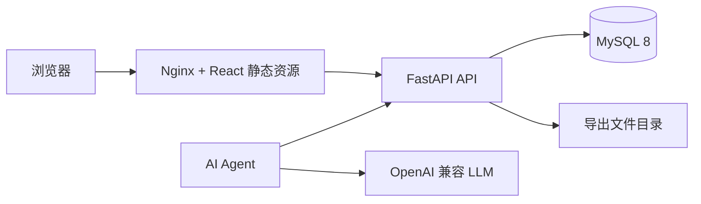

# LabelHub 演示环境说明

## 1. 环境用途

演示环境用于展示 LabelHub 的完整产品链路，包括任务创建、数据导入、模板搭建、标注作答、AI 自动预审、人工审核、数据验收和结果导出。该环境以公网 IP 方式访问，不依赖域名。

## 2. 访问地址

```text
http://121.196.209.131:18080/
```

浏览器直接打开以上地址即可进入登录页。

## 3. 演示账号

| 角色 | 邮箱 | 密码 | 主要入口 |
| --- | --- | --- | --- |
| 任务负责人 Owner | `owner@labelhub.dev` | `labelhub123` | 任务管理、模板工作台、数据验收、导出中心 |
| 标注员 Labeler | `labeler@labelhub.dev` | `labelhub123` | 任务广场、标注工作台、我的贡献 |
| 人工审核员 Reviewer | `reviewer@labelhub.dev` | `labelhub123` | AI 预审队列、人工审核、审核结果 |

## 4. 环境组成



| 服务 | 说明 |
| --- | --- |
| Web | 提供前端页面和 `/api` 反向代理 |
| API | 提供业务接口、状态机、审计日志和导出文件生成 |
| Agent | 轮询 AI 预审任务并写回结构化结果 |
| MySQL | 保存用户、任务、数据集、模板、提交、审核、审计和导出数据 |

## 5. 推荐演示流程

### 5.1 Owner 准备任务

1. 使用 Owner 账号登录。
2. 在“任务管理”中新建任务。
3. 在任务数据集页导入 `qa_quality` 或 `preference_compare` 数据。
4. 进入“模板搭建器”，配置题目展示、作答字段和 LLM 辅助组件。
5. 配置并发布审核规则。
6. 通过发布检查后发布任务。

### 5.2 Labeler 提交标注

1. 使用 Labeler 账号登录。
2. 在“任务广场”领取已发布任务。
3. 在标注工作台查看原始题目，填写作答字段。
4. 可使用题目级 AI 辅助生成参考建议。
5. 保存草稿或提交正式标注。

### 5.3 AI 预审与人工审核

1. Agent 自动领取提交后的 AI 预审任务。
2. 使用 Reviewer 账号进入“AI 预审队列”查看结构化评分和建议。
3. 进入“人工审核”任务列表，选择任务进入审核工作台。
4. 查看多轮 diff、AI 评语和关键流转时间线。
5. 执行通过入库、打回或直接修订。

### 5.4 Owner 数据验收与导出

1. 使用 Owner 账号进入任务的数据验收页。
2. 查看通过、打回、待审和 AI 结论分布。
3. 进入导出中心，选择 JSON、JSONL、CSV 或 Excel。
4. 配置字段映射并创建导出任务。
5. 在导出历史中下载生成文件。

## 6. 演示数据

| 数据集 | 路径 | 用途 |
| --- | --- | --- |
| `qa_quality` | `demo_data/datasets/qa_quality` | 问答质量评估、评分维度、证据上传、AI 预审 |
| `preference_compare` | `demo_data/datasets/preference_compare` | 偏好对比、A/B 回答、理由填写、多轮复核和导出 |

## 7. 验收关注点

| 关注点 | 验证方式 |
| --- | --- |
| 多角色入口 | 三类账号分别进入不同工作台 |
| 动态模板 | Owner 搭建的同一份 Schema 被预览、Labeler 作答和导出字段复用 |
| 状态流转 | 任务、领取、提交、AI 预审、人工审核、导出均由后端状态机驱动 |
| AI 能力 | 题目级辅助不自动提交，提交后 AI 预审写回结构化评分和建议 |
| 人工复核 | Reviewer 能查看多轮 diff、AI 评语、关键流转时间线并执行决策 |
| 数据导出 | 只导出人工审核通过的数据，支持多格式和字段映射 |

## 8. 说明

- 演示环境使用公网 IP 访问，未配置域名。
- 真实密钥只在服务器环境变量中配置，不出现在仓库文件和文档中。
- 若浏览器缓存导致页面状态异常，可退出登录后重新进入对应角色工作台。
