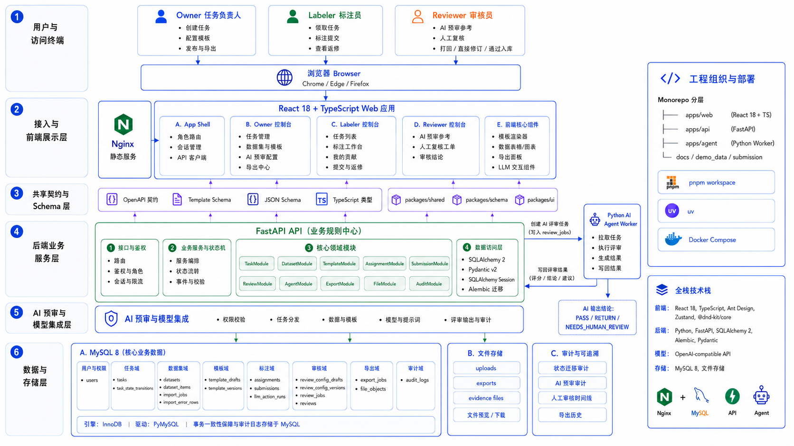
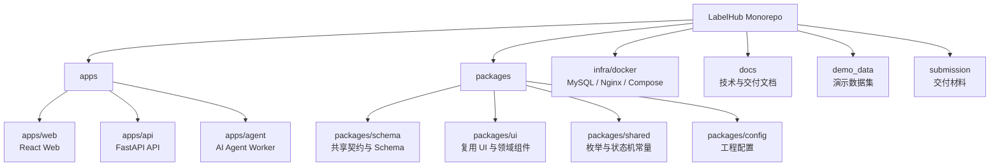
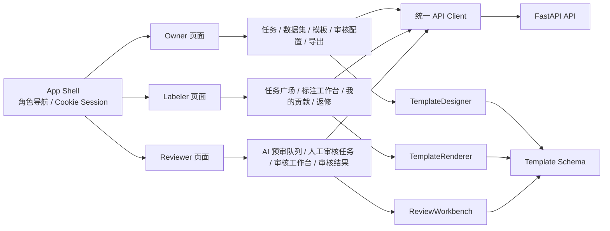
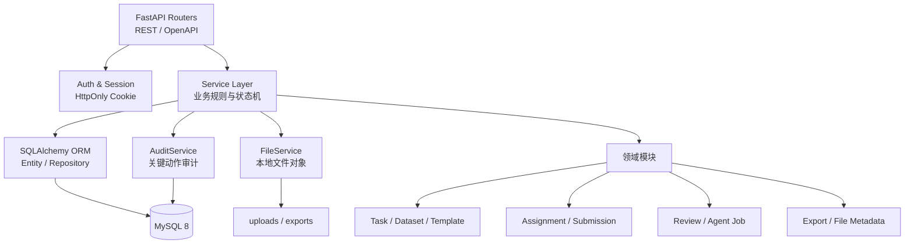
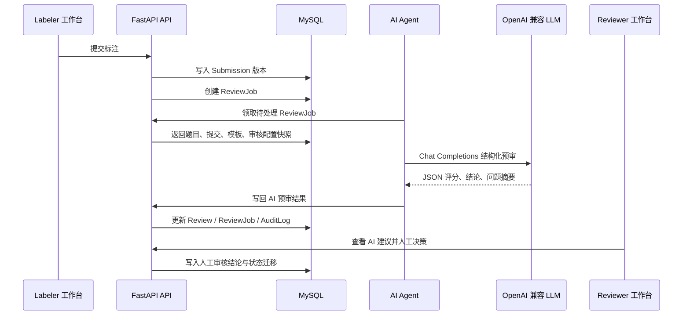
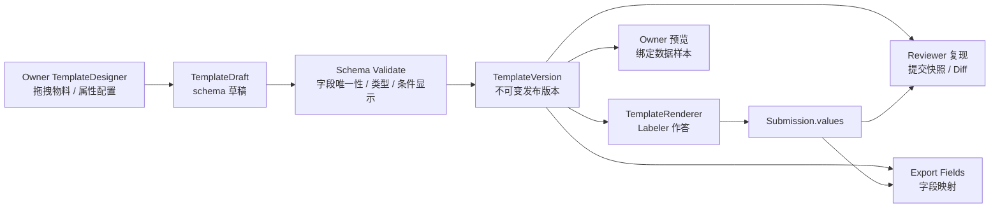
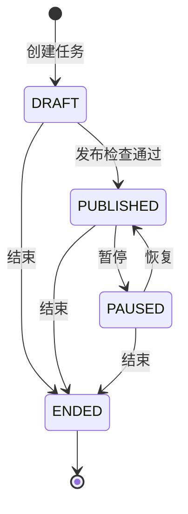
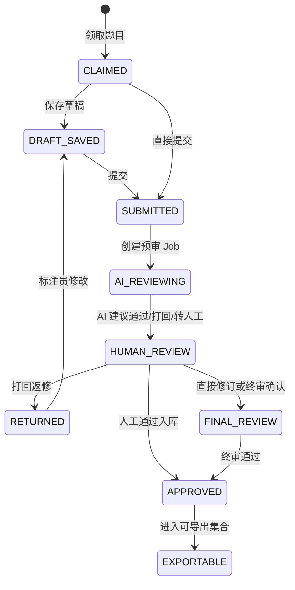
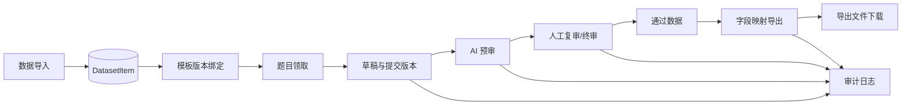

# LabelHub 系统架构文档

## 1. 架构原则

LabelHub 应采用前后端分离架构，并使用 monorepo 管理。架构设计需要服务于以下目标：

- 前端、后端、AI Agent 职责清晰。
- 动态模板 Designer 与 Renderer 解耦。
- 后端统一控制状态机、权限、事务和审计。
- AI Agent 异步运行，不阻塞用户提交。
- 通过 OpenAPI、JSON Schema、模板 Schema 和前端 TypeScript 类型生成避免前后端契约漂移。
- 目录结构清晰，便于维护、部署和交付。

## 2. 总体架构



## 3. Monorepo 当前目录组织

当前代码已经按以下目录组织：

```text
LabelHub/
  apps/
    web/                  # 前端 Web 应用，包含 Owner、Labeler、Reviewer 页面
    api/                  # Python 后端 API 服务，负责鉴权、业务状态、数据访问
    agent/                # Python AI 审核 Agent，消费队列并按 OpenAI API 格式调用 LLM
  packages/
    shared/               # 前端共享领域常量、枚举、状态机类型
    schema/               # 语言无关的模板 schema、JSON Schema、OpenAPI 契约
    ui/                   # 可复用 UI 组件和领域展示组件
    config/               # tsconfig、eslint、prettier 等共享配置
  infra/
    docker/               # 本地开发与部署依赖，例如 MySQL、Nginx
  docs/                   # 项目文档
  demo_data/              # 演示数据
  submission/             # 交付材料
```



说明：

- `apps/web` 只负责页面、交互和前端状态，不直接实现后端状态机。
- `apps/api` 是所有业务写操作入口，负责权限、校验、事务和审计。
- `apps/agent` 只能通过受控接口或后端服务写入 AI 审核结果，不能绕过状态机。
- `packages/schema` 定位为前后端共享契约预留目录；当前后端通过 Pydantic/OpenAPI 暴露契约，前端按契约维护 TypeScript 类型。
- `packages/ui` 只放跨页面复用 UI，不包含业务数据访问逻辑。

## 4. 前端架构

### 4.1 页面分区

前端 Web 应用按角色拆分页面。

Owner：

- 任务管理列表。
- 任务创建/编辑。
- 数据集导入和预览。
- 模板搭建器。
- AI 审核配置。
- 数据验收。
- 导出中心和导出历史。

Labeler：

- 任务广场。
- 标注工作台。
- 我的贡献。
- 打回修改列表。

Reviewer：

- AI 预审队列。
- 人工审核任务列表。
- 任务内人工审核工作台。
- 审核深度详情。
- 审核结果追溯。

### 4.2 前端核心模块

| 模块 | 职责 |
| --- | --- |
| TemplateDesigner | 模板搭建器，负责拖拽、布局、属性配置和 schema 保存 |
| TemplateRenderer | 模板渲染器，负责根据 schema 渲染标注表单 |
| ShowItemRenderer | 渲染题目原始数据，支持文本、图片、视频、Markdown |
| AnnotationWorkbench | 标注工作台，处理题目切换、草稿、提交 |
| ReviewWorkbench | 审核工作台，展示 AI 评语、diff、审核操作 |
| ExportPanel | 导出配置、导出历史、下载入口 |



### 4.3 前端状态管理建议

- 服务端数据通过统一 API Client 进入页面状态，跨页面共享状态统一使用 Zustand 管理。
- 客户端状态管理统一使用 Zustand。
- 表单状态和 Schema 渲染使用 Formily。
- 草稿自动保存使用 debounce，保存到后端。

## 5. 后端架构

### 5.1 后端服务职责

后端 API 是业务规则中心，必须负责：

- 鉴权和角色权限。
- 任务状态机。
- 模板版本管理。
- 数据导入和校验。
- 领取和配额控制。
- 草稿、提交和版本管理。
- AI 审核入队。
- 人工审核流转。
- 导出任务创建和文件生成。
- 审计日志。

### 5.2 后端模块划分

| 模块 | 职责 |
| --- | --- |
| AuthModule | 登录、登出、当前用户、系统账号 |
| UserModule | 用户、角色、权限 |
| TaskModule | 任务基础信息、状态迁移、发布检查 |
| DatasetModule | 数据集、题目导入、题目预览 |
| TemplateModule | 模板草稿、模板版本、schema 校验 |
| AssignmentModule | 题目领取、锁定、配额 |
| SubmissionModule | 草稿保存、提交、提交版本 |
| ReviewModule | AI 审核结果、人工审核、打回、通过 |
| AgentModule | AI review job 创建、领取、写回 |
| ExportModule | 导出配置、异步导出、下载历史 |
| AuditModule | 审计日志统一写入和查询 |
| FileModule | 导入文件、标注证据文件、导出文件元数据、图片预览和文件下载 |



## 6. AI Agent 架构

AI Agent 建议作为独立 Python worker 运行，属于后端系统的一部分，但与 API 服务进程分离。

处理流程：

1. Labeler 提交标注。
2. API 创建提交版本并写入数据库。
3. API 创建 AI 审核 job 并入队。
4. Agent 从队列领取 job。
5. Agent 查询题目、提交值、模板版本、审核配置。
6. Agent 组装 Prompt，并通过 OpenAI API 格式调用 LLM。
7. Agent 校验结构化输出。
8. Agent 写回 AI 审核结果。
9. API 或 ReviewWorkflowService 根据结果推进状态。
10. 写入审计日志。



AI 输出建议结构：

```json
{
  "conclusion": "PASS | RETURN | NEEDS_HUMAN_REVIEW",
  "scores": {
    "relevance": 5,
    "accuracy": 4,
    "format": 5,
    "safety": 5
  },
  "summary": "整体回答准确，但细节略有缺失。",
  "issues": [
    {
      "field": "accuracy",
      "message": "缺少关键解释。"
    }
  ],
  "suggestions": "建议补充原因说明。"
}
```

## 7. 动态模板架构

模板系统分为三层：



核心设计：

- Designer 保存的是平台自定义 Template Schema。
- Renderer 根据 Template Schema 渲染表单。
- Template Schema 不直接绑定某个 UI 组件库的内部实现。
- ShowItem 只展示原始数据，不参与提交。
- 采集字段才进入 submission values。
- 条件显示和校验使用声明式配置，不执行任意 JavaScript。

模板生命周期：

```text
TemplateDraft -> TemplateVersion -> Submission 使用指定版本
```

发布后的模板版本不可修改。如果任务发布后需要调整模板，应生成新版本，历史提交仍使用旧版本复现。

## 8. 状态流转架构

### 8.1 任务状态



其中“已发布”对应后端枚举 `PUBLISHED`，表示任务已通过发布检查并进入可领取/运行状态，不表示异步发布仍在处理中。

### 8.2 标注与审核状态



### 8.3 状态机约束

- 所有状态迁移必须由后端服务执行。
- 前端只能发起操作请求，不能决定最终状态。
- 状态迁移必须检查当前状态和版本号。
- 每次迁移必须写审计日志。
- 非法迁移返回冲突错误。

## 9. 数据流



### 9.1 导入数据流

```text
Owner 上传文件
  -> 后端解析 JSON/JSONL/Excel
  -> 字段校验
  -> 归一化为 DatasetItem
  -> 写入导入结果
  -> 前端展示预览和错误行
```

### 9.2 标注提交流

```text
Labeler 作答
  -> 自动保存草稿
  -> 提交校验
  -> 创建 Submission 版本
  -> 返回已提交状态
  -> 创建 AI Review Job
```

### 9.3 审核流

```text
AI Agent 写回预审
  -> Reviewer 查看
  -> 通过或打回
  -> 审计日志记录
  -> 通过数据进入导出集合
```

### 9.4 导出流

```text
Owner 配置字段映射
  -> 创建 ExportJob
  -> 生成导出文件
  -> 更新导出状态
  -> Owner 下载文件
```

## 10. 技术选型基线

| 层 | 已确定选型 |
| --- | --- |
| 前端框架 | React 18 + TypeScript |
| UI 组件库 | Ant Design |
| 表单内核 | Formily + Schema 渲染 |
| 拖拽 | @dnd-kit/core |
| 状态管理 | Zustand |
| 前端构建与测试 | Vite、Vitest |
| 后端框架 | Python、FastAPI |
| 后端数据模型 | Pydantic v2 |
| 后端 ORM 与迁移 | SQLAlchemy 2、Alembic |
| 数据库 | MySQL 8、PyMySQL |
| 鉴权方式 | HttpOnly Cookie Session |
| LLM 接入 | OpenAI API 兼容格式，通过环境变量配置 |
| 部署 | Docker Compose、Nginx |

LLM 调用统一走 OpenAI API 兼容 HTTP 契约，不绑定供应商私有 SDK。题目级 LLM 辅助和 AI 预审 Agent 复用相同配置读取、超时控制和结构化输出校验。真实 API Key 不进入仓库；默认保持标准 Chat Completions 请求，如供应商需要额外请求体参数，统一通过 `OPENAI_EXTRA_BODY_JSON` 或 `LLM_EXTRA_BODY_JSON` 显式配置。

## 11. 安全与可靠性

- API 边界统一校验输入。
- Markdown 白名单渲染。
- 文件上传限制后缀、MIME、大小。
- LLM 输出必须通过 schema 校验。
- AI 失败可重试，最终进入人工复核。
- 导出只读取已通过数据。
- 所有密钥通过环境变量注入，不进入仓库。

## 12. 当前实现边界

- 已实现 React/Vite 前端工程、FastAPI 后端工程和 Python Agent worker。
- 已实现登录、退出、当前用户、健康检查、OpenAPI、统一错误结构和 MySQL 迁移体系。
- 已实现 Owner、Labeler、Reviewer 三类角色入口和受保护应用壳。
- 任务、数据集、导入、审核配置、发布检查、状态迁移、审计日志、模板草稿、模板版本、assignment、submission、题目级 LLM 调用记录、AI 预审 job、人工审核记录和导出任务均已接入 MySQL。
- Owner 链路已覆盖任务创建、数据导入、模板搭建、审核配置、发布检查、数据验收和导出中心。
- Labeler 链路已覆盖任务广场、领取、作答、草稿、提交、我的贡献、返修入口和题目级 LLM 辅助。
- Reviewer 链路已覆盖 AI 预审队列、人工审核任务列表、任务内复审/终审工作台、单条/批量决策、直接修订入库、关键审计时间线和审核结果追溯。
- 导出链路已覆盖字段映射、JSON/JSONL/CSV/Excel 文件生成、导出历史、失败重试、下载和审计记录。
- 部署链路已提供 Docker Compose 与公网演示环境说明。
