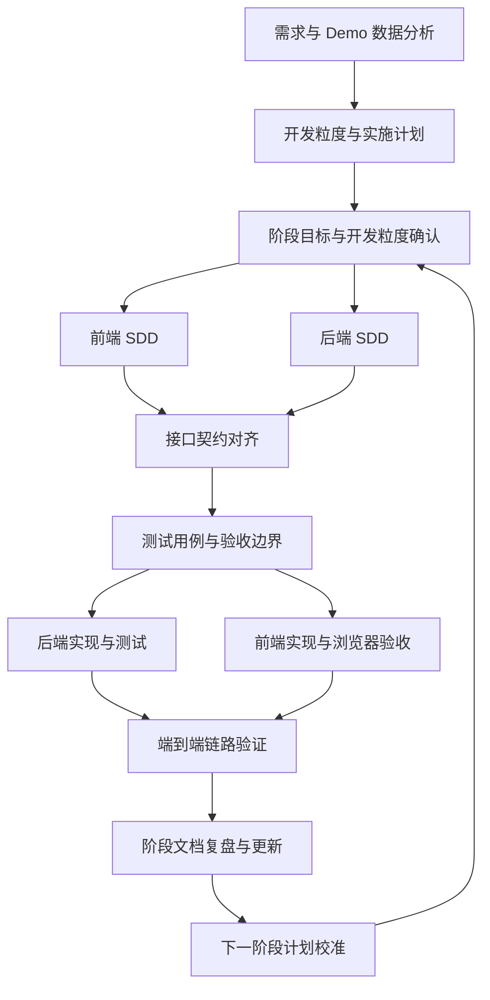

# AI Coding 过程实现思路说明

## 1. 文档目的

本文记录 LabelHub 在实现过程中的 AI Coding 协作方法、规格驱动流程、阶段计划、原型设计、测试策略、浏览器检查方式和质量控制策略。该文档用于说明项目如何从需求拆解、执行粒度规划、接口契约、前后端实现、真实页面验收到交付文档持续收口。

## 2. 总体方法

项目采用 SDD（Spec Driven Development）驱动的全栈开发流程：

核心原则：

- 先写清楚需求边界、数据模型和接口契约，再进入代码实现。
- 以 `开发粒度与实施计划` 作为项目推进主轴，把整体实现拆分为大小适中的阶段和可验收粒度。
- 前端 VO 字段与后端 JSON 字段保持一一对应。
- 每个开发粒度都同时关注页面、接口、状态机、数据库和测试。
- 每个粒度在实现代码的同时生成并执行对应测试，遵循 Test Driven Development 的质量闭环。
- 真实浏览器检查作为前端页面交付前的必要环节。
- 文档随着代码反向校验和迭代；每个阶段结束后，代码实现会反过来推动需求、架构、数据库、测试和部署文档更新。

## 3. 使用的能力与工具

| 能力 | 用途 |
| --- | --- |
| `spec-driven-development` | 需求拆解、SDD 对齐、接口契约先行 |
| `frontend-ui-engineering` | 前端页面布局、交互体验和组件质量优化 |
| `api-and-interface-design` | REST API、VO/DTO、错误结构和状态机设计 |
| `test-driven-development` | 单元测试、集成测试和回归验证 |
| `documentation-and-adrs` | 需求、架构、数据库、测试、部署和交付文档维护 |
| `shipping-and-launch` | 部署配置、演示环境和交付检查 |
| Google Stitch | 初期生成登录、任务管理、标注、审核等核心页面的视觉原型 |
| Product Design 插件 | 结合现有页面风格和阶段需求，细化阶段页面原型与交互布局 |
| Chrome DevTools MCP | 对前端页面进行真实浏览器检查、控制台和网络请求核验 |

## 4. 阶段推进方式

### 4.1 需求基线

先将实现要求、Demo 数据和业务角色沉淀为：

- `docs/需求分析文档.md`
- `docs/Demo范围文档.md`
- `docs/系统架构文档.md`
- `docs/数据库设计文档.md`
- `docs/技术选型基线.md`

这些文档确定了任务、数据集、模板、标注、AI 预审、人工审核、导出和审计日志等核心边界。

### 4.2 开发粒度拆分

项目初期先建立 `docs/开发粒度与实施计划.md`，要求 Agent 将完整建设过程拆分为若干阶段。阶段大小遵循“可独立交付、可测试、不过度拆碎”的原则；每个阶段再拆成若干功能粒度，明确该粒度的前端页面、后端接口、数据表或状态机、测试范围和验收标准。

该计划将开发拆为若干可验收粒度：

- 任务管理与数据导入。
- 动态模板 Designer / Renderer。
- 标注员任务广场与作答工作台。
- AI 自动预审与人工审核流转。
- 数据验收与多格式导出。
- 部署、测试报告和交付材料。

每个粒度都明确前端页面、后端接口、数据库对象、验收标准和测试边界。

### 4.3 阶段复盘与计划校准

每一阶段完成后，都会要求 Agent 结合当前仓库中已经实现的代码，对项目内全部关键文档做一次复盘和更新，包括但不限于：

- `docs/需求分析文档.md`
- `docs/Demo范围文档.md`
- `docs/系统架构文档.md`
- `docs/数据库设计文档.md`
- `docs/技术选型基线.md`
- `docs/开发粒度与实施计划.md`
- `apps/web/SDD.md`
- `apps/api/SDD.md`

复盘重点不是补充开发日志，而是检查文档是否仍与当前代码、数据库结构、接口契约和页面体验一致。若实现过程中发现计划粒度过大、过小、遗漏关键能力或顺序不合理，则在进入下一阶段前先调整下一阶段计划，确保后续开发目标始终与真实代码和产品状态对齐。

### 4.4 SDD 对齐

正式编码前维护两份核心 SDD：

- `apps/web/SDD.md`
- `apps/api/SDD.md`

当接口、字段、状态或页面职责变化时，先更新 SDD，再实现前后端代码。这样可以确保 Owner、Labeler、Reviewer、Agent 之间共享同一套契约，而不是各自临时适配。

### 4.5 原型与产品设计

初期会根据项目整体功能和关键页面需求，使用 Google Stitch 生成登录页、Owner 工作台、标注工作台、审核工作台等核心页面原型，用于确定产品调性、页面信息密度和基础视觉风格。

后续进入具体阶段时，再使用 Product Design 插件结合当前已实现页面、阶段目标和进一步设计要求，生成更贴近实际业务流的页面原型。例如模板搭建器、AI 预审队列、人工审核工作台、导出中心等页面都会先明确布局和交互重点，再作为前端代码生成和优化的参考。原型用于指导体验和信息架构，最终功能边界仍以需求文档、SDD 和实现计划为准。

### 4.6 代码实现

每次实现都会明确要求 Agent 遵循以下标准：“在实现代码时，要确保代码和产品设计的最优性，保持精简准确，并且要给出少量核心注释。”

具体实现原则包括：

- 使用 React 18 + TypeScript + Ant Design 保持前端一致体验。
- 使用 FastAPI + Pydantic + SQLAlchemy 保持后端接口和实体清晰。
- 使用 Alembic 管理数据库迁移。
- Agent 使用 OpenAI API 兼容格式，不绑定供应商私有 SDK。
- 代码注释只保留关键业务规则，例如状态机保护、不可变版本、审计过滤等。

### 4.7 测试同步

每个开发粒度都伴随测试代码的生成和执行，遵循 Test Driven Development 的推进方式：

- 先基于 SDD、接口契约和验收边界明确测试用例。
- 后端优先覆盖服务函数、Schema 校验、状态机和 API 集成流程。
- 前端优先覆盖关键纯函数、数据格式化、接口适配和页面关键状态。
- 对任务创建、模板发布、标注提交、AI 预审、人工审核、导出任务等核心流程进行集成验证。
- 每一阶段开发完成后，至少执行该阶段覆盖范围内的基础单元测试和集成测试，确认新增能力与既有核心链路没有回归。
- 测试失败时先区分是测试代码问题、环境问题还是业务实现问题；业务实现问题会记录并进入修复闭环。

### 4.8 浏览器验收

每一阶段涉及前端页面交付时，都会通过 Chrome DevTools MCP 执行真实页面检查：

- 打开本地前端页面。
- 检查登录、路由跳转、表单提交、弹窗、抽屉和按钮状态。
- 检查 Network 请求是否返回预期状态码。
- 检查 Console 是否存在业务错误。
- 检查典型视口下是否有遮挡、横向溢出和布局不均衡。

这一流程用于修复登录页、任务管理、模板搭建器、标注工作台、AI 预审队列、人工审核工作台、审核结果页和导出中心中的真实交互问题。

最终交付前会额外执行一次系统全功能流程的真实浏览器验收。该验收不会直接临场随意点击，而是先生成测试脚本，明确验收分为哪些阶段、每个阶段如何操作、需要观察哪些页面状态和数据结果；随后按脚本执行真实浏览器操作，并在执行过程中同步记录每一步结果。该流程覆盖 Owner 创建任务与模板发布、Labeler 领取与提交、Agent AI 预审、Reviewer 人工审核、数据验收与导出结果等主链路，用于形成最终的全流程验收报告。

### 4.9 文档优先的闭环

整个流程的核心是“文档优先、SDD 驱动、阶段反哺文档”。`开发粒度与实施计划` 决定每一阶段做什么，前后端 SDD 决定接口契约怎么对齐，测试报告和浏览器验收记录决定实现是否达标。每一阶段完成后，Agent 会基于实际代码反查文档，把已经变化的产品逻辑、接口、数据库、部署方式和测试结论更新回文档，避免出现“代码已经演进，文档仍停留在旧设计”的问题。

## 5. 关键实现取舍

### 5.1 模板与任务关系

当前采用“任务拥有模板”的模型：每个任务有一份可编辑模板草稿，并可发布多个不可变模板版本。任务发布时绑定当前模板版本，Labeler 领取题目时固化该版本，避免后续模板调整影响历史提交和审核。

### 5.2 AI 辅助与 AI 预审分离

题目级 LLM 辅助只服务于 Labeler 作答，生成参考建议，不自动提交。AI 自动预审发生在正式提交之后，由 Agent 读取提交快照和审核配置，输出结构化评分和审核建议。

### 5.3 人工审核按任务组织

AI 预审队列可以跨任务展示所有 Job，但人工审核按任务组织，进入任务后再处理该任务下的记录。这样能减少跨任务误操作，并让批量通过、批量打回、多轮 diff 和关键时间线处在同一任务上下文中。

### 5.4 导出只面向通过数据

导出中心只导出人工审核通过的数据，字段映射在创建导出任务时保存为快照。这样可以保证历史导出可复现，并避免后续模板或字段名变化影响已生成文件。

## 6. 测试与质量闭环

项目将测试分为三层：

| 类型 | 说明 |
| --- | --- |
| 单元测试 | 覆盖纯函数、Schema 校验、服务逻辑、Agent 配置与解析 |
| 集成测试 | 覆盖 API + 数据库会话、状态机、AI 预审写回、人工审核、导出 |
| 阶段浏览器检查 | 每阶段页面完成后使用 Chrome DevTools MCP 检查页面交互、请求、控制台和布局 |
| 全流程浏览器验收 | 交付前先设计测试脚本，再按脚本执行完整用户链路并边执行边记录结果 |

对应报告：

- `docs/单元测试报告.md`
- `docs/集成测试报告.md`
- `docs/真实浏览器全流程验收测试报告.md`

## 7. 交付收口

交付阶段重点处理：

- README 从开发记录改为项目说明。
- 文档统一更新为当前实现状态。
- `submission/` 按交付物类型复制整理。
- API 文档、演示环境说明和部署说明补齐。
- 测试报告只保留最终通过的验证信息。
- 全仓库扫描敏感信息，确保真实密钥不进入文档或提交物。

## 8. 过程文件清单

| 文件 | 作用 |
| --- | --- |
| `docs/开发粒度与实施计划.md` | 全局开发拆解和每个粒度的实现计划 |
| `apps/web/SDD.md` | 前端页面、VO、接口调用和浏览器验收约束 |
| `apps/api/SDD.md` | 后端 API、DTO、Entity、状态机和 Agent 契约 |
| `docs/系统架构文档.md` | 运行时架构、模块边界和数据流 |
| `submission/API文档.md` | 交付阶段 API 契约总览 |

